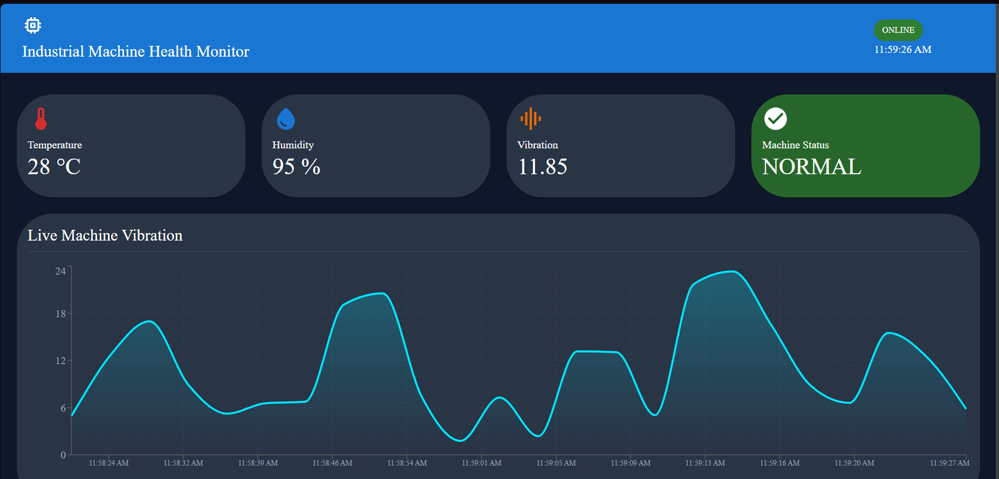
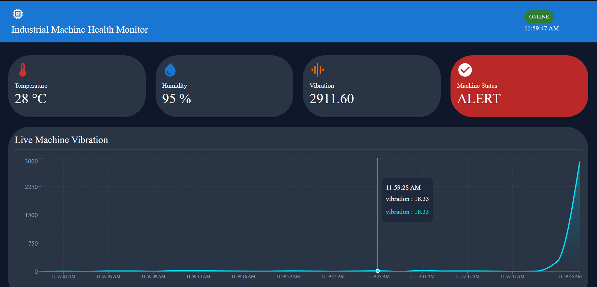
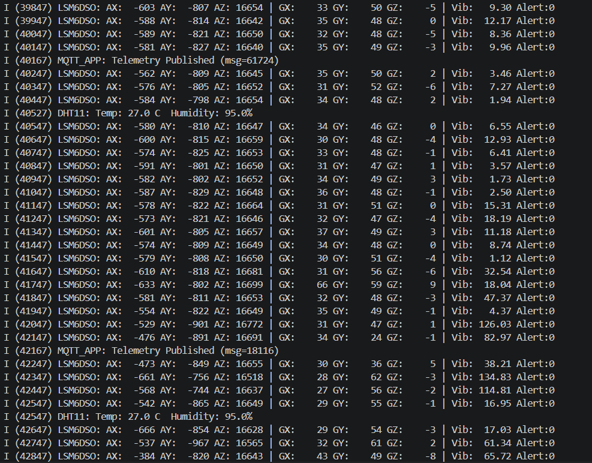

# FreeRTOS-AWS-Machine-Telemetry
"A FreeRTOS-based Industrial IoT Telemetry System using ESP-IDF on ESP32-S3 with AWS IoT Core Integration."

## ⭐ Project Highlights

- Built entirely using **ESP-IDF** on the ESP32-S3.
- Designed around **FreeRTOS multitasking** instead of a polling loop.
- Independent sensor acquisition tasks running concurrently.
- Thread-safe shared data using **FreeRTOS mutexes**.
- Secure MQTT communication with **AWS IoT Core** using TLS certificates.
- Cloud telemetry processing using **AWS IoT Rules**, **Lambda**, and **DynamoDB**.
- REST API built with **API Gateway**.
- Live monitoring dashboard developed in **React**.
- Modular firmware architecture suitable for future expansion.

- 
- 

- # FreeRTOS Design

The firmware is implemented using the FreeRTOS kernel provided by ESP-IDF.

### Tasks
        
        - LSM6DSO Sensor Task
            - Reads IMU data periodically over SPI.
            - Computes vibration magnitude.
            - Updates shared telemetry.
        
        - DHT11 Sensor Task
            - Reads temperature and humidity.
            - Updates shared telemetry.
        
        - MQTT Publishing Task
            - Publishes telemetry to AWS IoT Core at fixed intervals.
        
        - WiFi Management Task
            - Handles network connectivity.

### Synchronization

Shared sensor data is protected using:

- FreeRTOS Mutex (`SemaphoreHandle_t`)
- Thread-safe shared telemetry structure

### Scheduling

The system uses preemptive multitasking to allow multiple real-time tasks to execute concurrently without blocking one another.

### Advantages

- Non-blocking firmware architecture
- Easy scalability
- Independent task execution
- Improved responsiveness
- Modular embedded software design

- # ESP-IDF Features Used

                  - ESP-IDF Framework
                  - FreeRTOS
                  - SPI Driver
                  - GPIO Driver
                  - MQTT Client
                  - WiFi Station Mode
                  - TLS (mbedTLS)
                  - Event Loop
                  - Logging (ESP_LOGI / ESP_LOGE)
  
- # esp-idf serial monitor output  
    
- # Cloud Architecture

                            ESP32-S3
                            
                            ↓
                            
                            AWS IoT Core
                            
                            ↓
                            
                            IoT Rule
                            
                            ↓
                            
                            AWS Lambda
                            
                            ↓
                            
                            Amazon DynamoDB
                            
                            ↓
                            
                            API Gateway
                            
                            ↓
                            
                            React Dashboard  

# Skills Demonstrated

## Embedded Systems

- ESP32-S3 Firmware Development
- ESP-IDF
- FreeRTOS
- Task Scheduling
- Inter-task Synchronization
- SPI Communication
- GPIO Programming
- Sensor Integration
- Embedded C

## IoT

- MQTT Protocol
- Secure TLS Communication
- AWS IoT Core
- Device Certificates
- Cloud Telemetry

## Cloud

- AWS Lambda
- DynamoDB
- API Gateway

## Frontend

- React
- Material UI
- Recharts
- Axios

- # Key Learning Outcomes

Through this project I learned:

- Designing modular embedded firmware using FreeRTOS.
- Developing concurrent applications using multiple RTOS tasks.
- Synchronizing shared resources using mutexes.
- Secure cloud connectivity using MQTT over TLS.
- Building complete IoT data pipelines using AWS services.
- Developing a live web dashboard for telemetry visualization.

- # Why This Project?

The objective of this project was to demonstrate practical knowledge of:

- Real-Time Operating Systems (FreeRTOS)
- ESP-IDF firmware development
- Secure Industrial IoT communication
- Cloud integration with AWS
- End-to-end telemetry visualization

Instead of focusing only on sensor interfacing, the project emphasizes software architecture, multitasking, synchronization, and scalable IoT system design.
